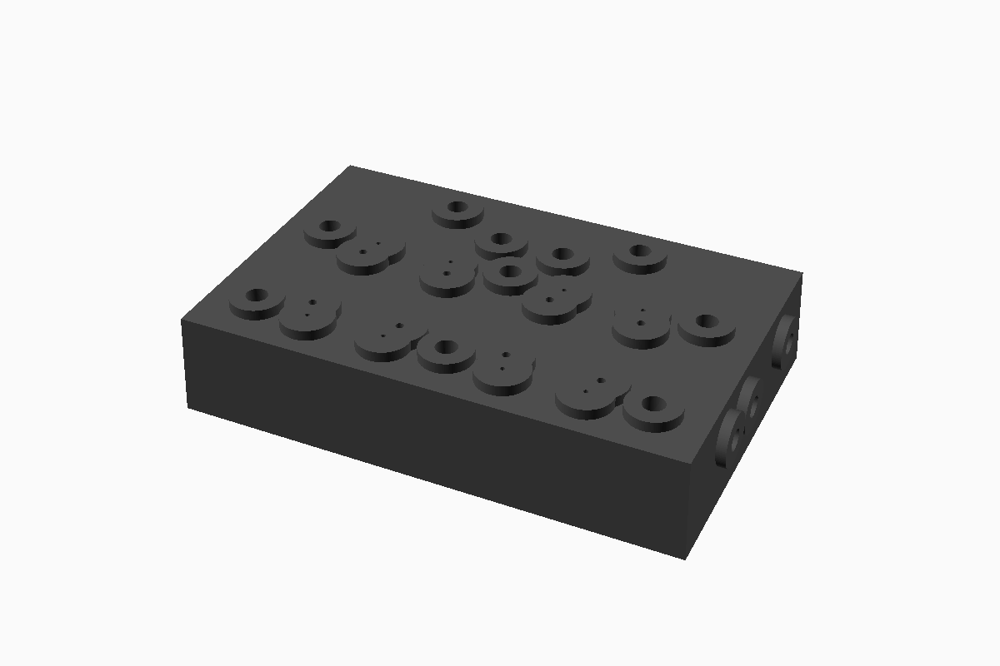
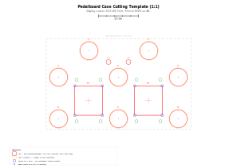
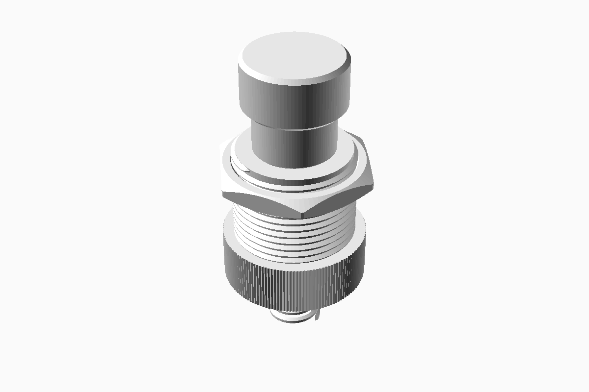
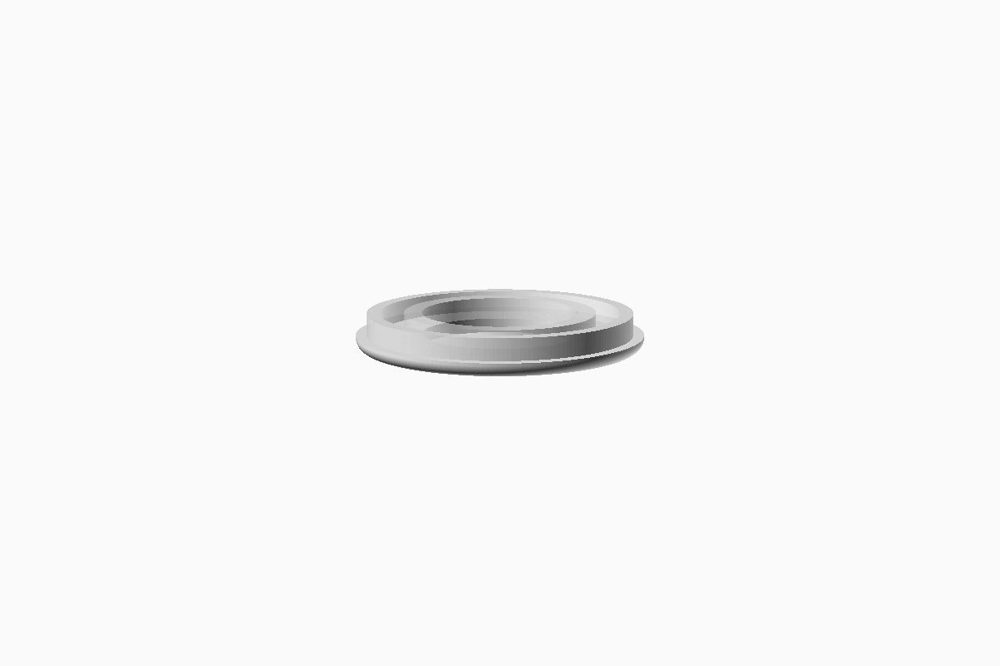
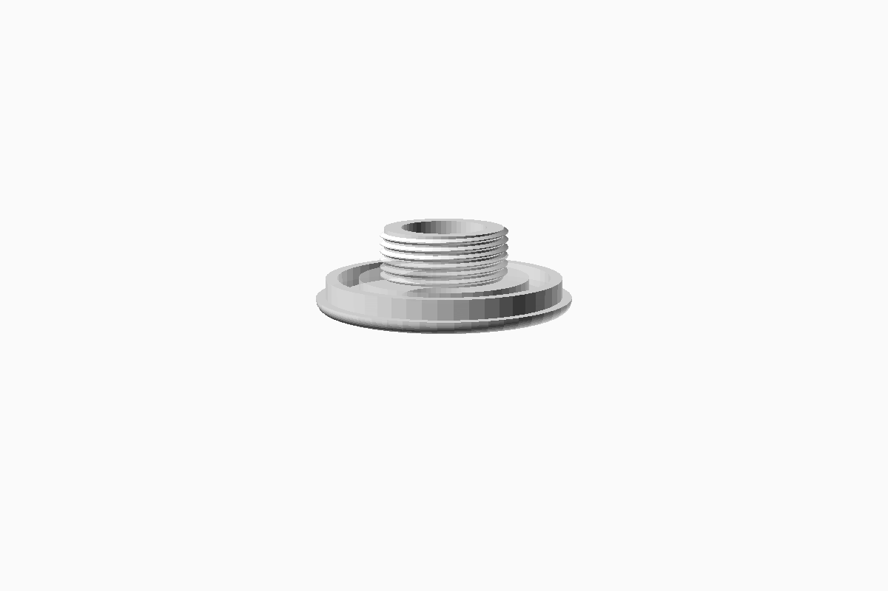
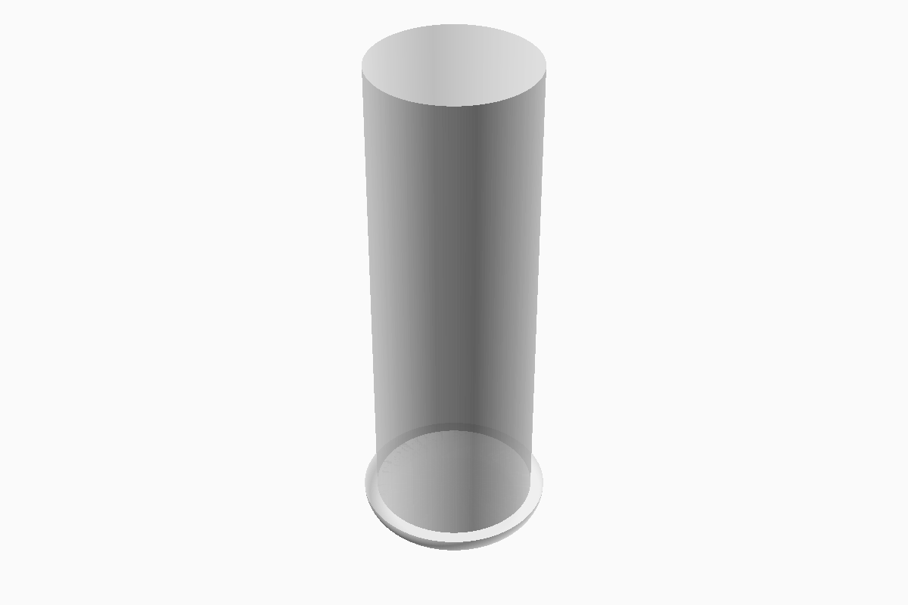
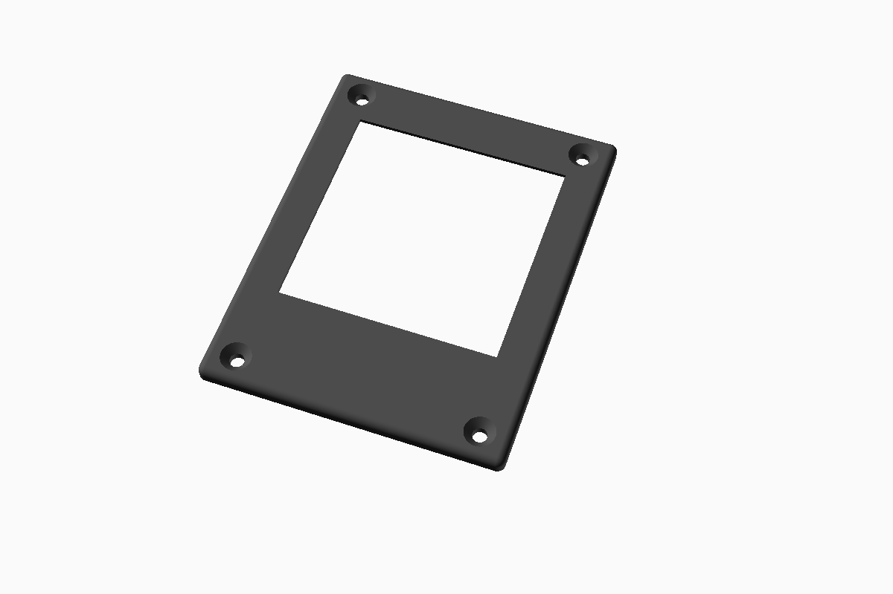
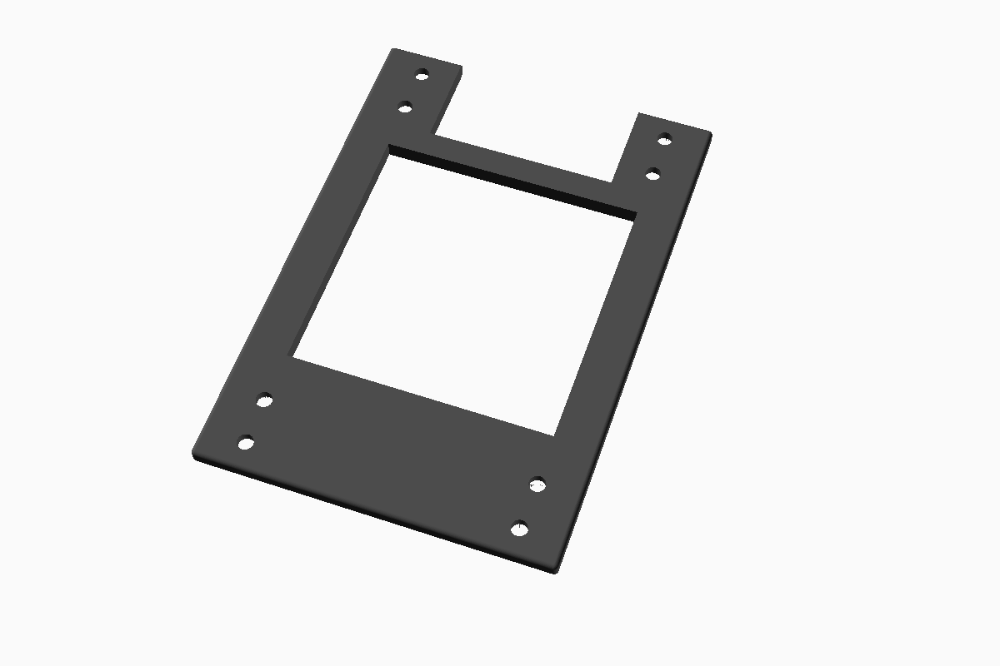
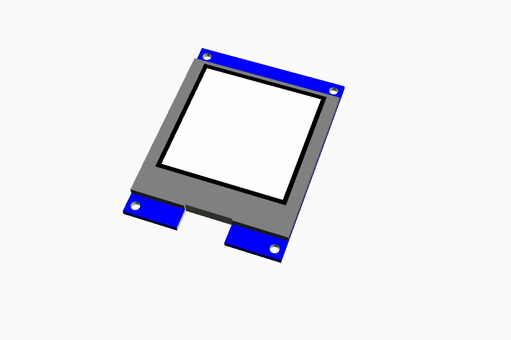

# pedalboard-case

Mechanical 3D models enclosing the hardware.

The parts are created with openscad 2021.01

## Parts

<table>
<tr>
    <th>Part</th>
    <th>Description</th>
    <th>Image</th>
</tr>
<tr>
    <td><a href="./generated/drill-jig.stl">Drill Jig</a></td>
    <td>
        3d model for a drill jig for a - <a href="https://www.hammfg.com/part/1590DD">Hammond Manufacturing 1590DD</a> case.
    </td>
    <td></td>
</tr>
<tr>
    <td><a href="./generated/display-cutout-template.pdf">Front Panel Cutting Template</a></td>
    <td>
       1:1 printable PDF for marking all front panel holes: 6 button holes (ø22.3mm),
       2 encoder holes (ø22.3mm), 2 display cutouts (34.5×36.7mm), 2 light pipe holes (ø6mm),
       and 8 bezel mount holes (ø4mm). Print at 100% scale on A4.
    </td>
    <td></td>
</tr>
<tr>
    <td><a href="./generated/top-panel.nc">CNC G-code</a></td>
    <td>
       G-code for CNC milling the top panel. Default: 4mm single flute downcut,
       300mm/min feed, 0.3mm depth/pass. Origin: front-left corner of top flat surface.
       Regenerate with <code>cd parts && make gcode</code>.
    </td>
    <td></td>
</tr>
<tr>
    <td><a href="./generated/top-panel.dxf">CNC Shop DXF</a></td>
    <td>
       2D DXF with all cut profiles for sending to a CNC shop.
       Layers: CUT (through-cut profiles), DRILL (bezel holes), OUTLINE (reference).
    </td>
    <td></td>
</tr>
<tr>
    <td><a href="./generated/actuator-assembly.stl">Switch Actuator</a></td>
    <td>
       <a href="https://www.cliffuk.co.uk/products/switches/FC7125.pdf">Manufactured by Cliff</a>.
    </td>
    <td></td>
</tr>
<tr>
    <td><a href="./generated/led-ring-washer.stl">Button Washer</a></td>
    <td>
       LED ring washer for Switch Actuator. Print with transparent PETG.
    </td>
    <td></td>
</tr>
<tr>
    <td><a href="./generated/led-ring-rotary-washer.stl">Rotary Encoder Washer</a></td>
    <td>
       LED ring washer for Rotary Encoder. Print with transparent PETG.
    </td>
    <td></td>
</tr>
<tr>
    <td><a href="./generated/light-pipe.stl">Light Pipe</a></td>
    <td>
       Print with transparent PETG.
    </td>
    <td></td>
</tr>

<tr>
    <td><a href="./generated/display-bezel.stl">Display Bezel</a></td>
    <td>
       Display bezel for 128x128 pixel OLED Display (1.5")
    </td>
    <td></td>
</tr>
 <tr>
    <td><a href="./generated/display-mounting-rack.stl">Display Mounting Rack</a></td>
    <td>
       Display mounting rack for 128x128 pixel OLED Display (1.5")
    </td>
    <td></td>
</tr>
<tr>
    <td><a href="./generated/oled-display.stl">OLED Display</a></td>
    <td>
      Model of the 128x128 pixel OLED display (1.5")
    </td>
    <td></td>
</tr>
</table>

## 3D printable files

See [STL files](./generated)

## Top panel generation

All top panel machining outputs are derived from the [pedalboard-display](https://github.com/pedalboard/pedalboard-display) KiCad PCB:

```
pedalboard-display.kicad_pcb
  → extract-coords.py → top-panel-coords.json
  → top-panel-gcode.py → top-panel.nc
  → top-panel-dxf.py   → top-panel.dxf
  → top-panel-template.py → display-cutout-template.svg/.pdf
```

Regenerate after PCB changes:

```bash
cd parts && make panel
```
