# pedalboard-case

Mechanical 3D models enclosing the hardware.

The parts are created with openscad 2021.01

## Parts

<table>
<tr>
    <th>Part</th>
    <th>Description</th>
    <th>Image</th>
</tr>
<tr>
    <td><a href="./generated/side-panel-template.pdf">Side Panel Drill Template</a></td>
    <td>
       1:1 printable PDF for marking all side panel and back panel holes:
       6 jack holes (10mm), 2 MIDI/3.5mm holes (6mm), USB-A slot (8mm drill),
       and barrel jack (8mm). Align to top edge of case.
       Regenerate with <code>python3 parts/side-panel-template.py</code>.
    </td>
    <td>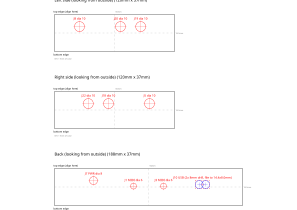</td>
</tr>
<tr>
    <td><a href="./generated/display-cutout-template.pdf">Front Panel Cutting Template</a></td>
    <td>
       1:1 printable PDF for marking all front panel holes: 6 button holes (ø22.3mm),
       2 encoder holes (ø22.3mm), 2 display cutouts (34.5×36.7mm), 2 light pipe holes (ø6mm),
       and 8 bezel mount holes (ø4mm). Print at 100% scale on A4.
    </td>
    <td>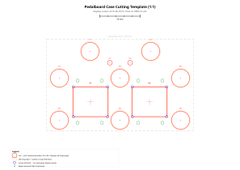</td>
</tr>
<tr>
    <td><a href="./parts/top-panel-gcode.py">CNC G-code</a></td>
    <td>
       G-code for CNC milling the top panel. Default: 4mm single flute downcut,
       300mm/min feed, 0.3mm depth/pass. Origin: case center (probe both sides).
       Regenerate with <code>python3 parts/top-panel-gcode.py</code>.
    </td>
    <td></td>
</tr>
<tr>
<tr>
    <td><a href="./generated/actuator-assembly.stl">Switch Actuator</a></td>
    <td>
       <a href="https://www.cliffuk.co.uk/products/switches/FC7125.pdf">Manufactured by Cliff</a>.
    </td>
    <td>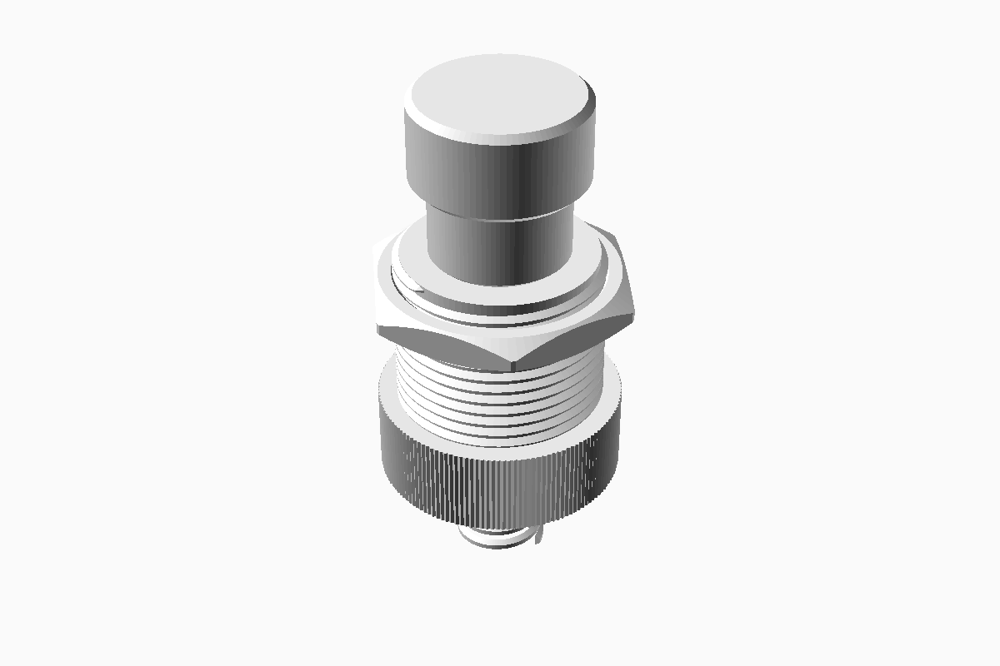</td>
</tr>
<tr>
    <td><a href="./generated/led-ring-washer.stl">Button Washer</a></td>
    <td>
       LED ring washer for Switch Actuator. Print with transparent PETG.
    </td>
    <td>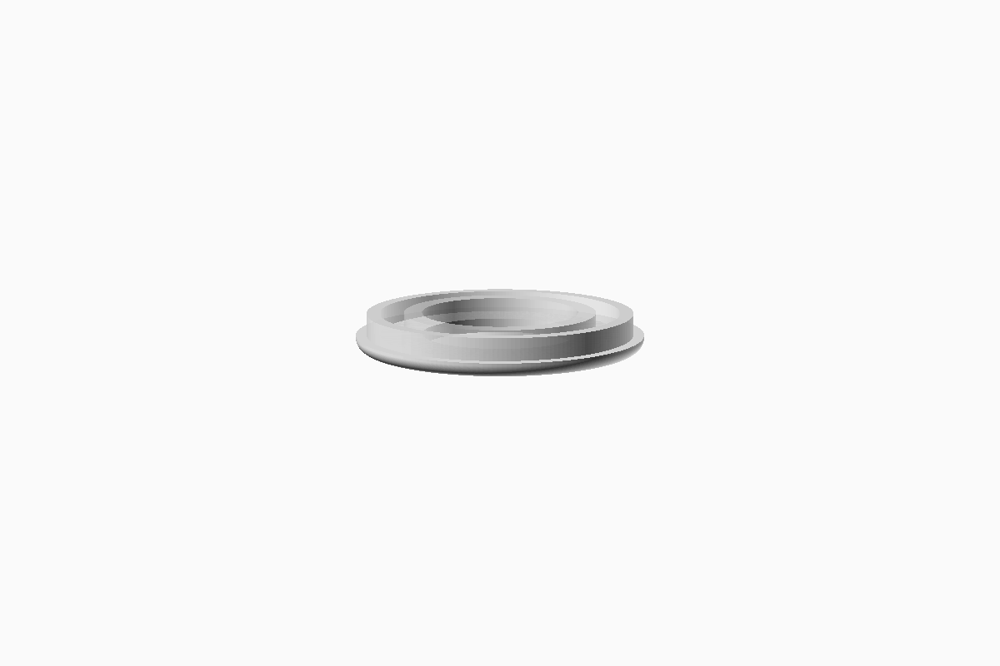</td>
</tr>
<tr>
    <td><a href="./generated/led-ring-rotary-washer.stl">Rotary Encoder Washer</a></td>
    <td>
       LED ring washer for Rotary Encoder. Print with transparent PETG.
    </td>
    <td>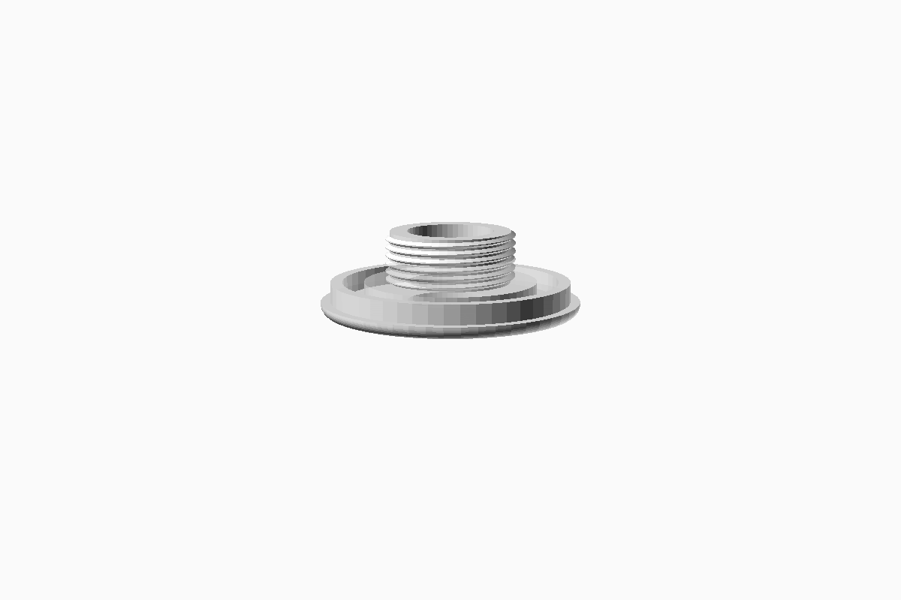</td>
</tr>
<tr>
    <td><a href="./generated/light-pipe.stl">Light Pipe</a></td>
    <td>
       Print with transparent PETG.
    </td>
    <td>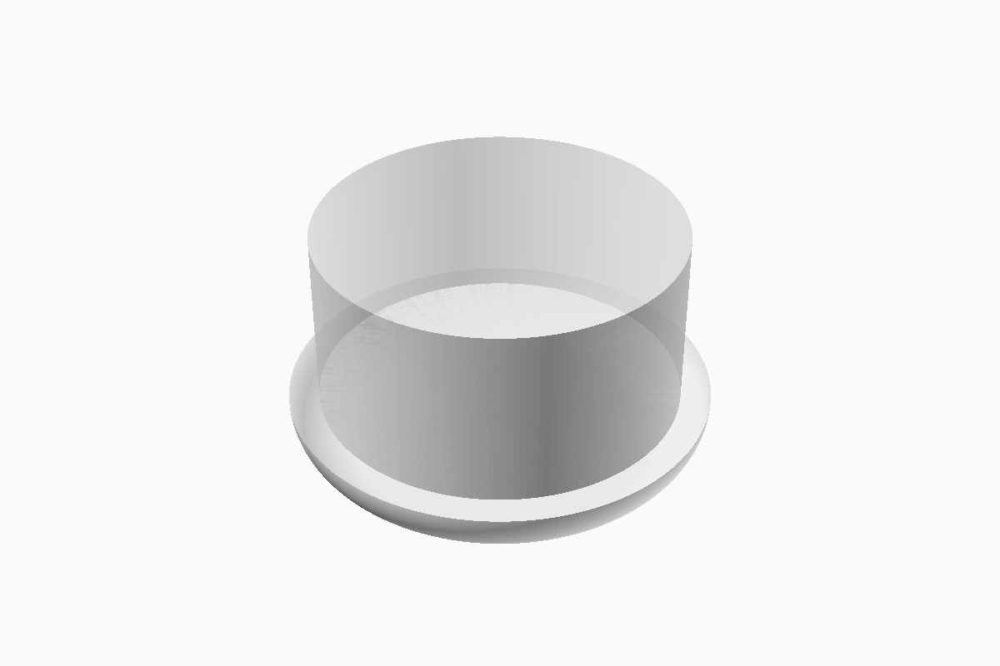</td>
</tr>

<tr>
    <td><a href="./generated/display-bezel.stl">Display Bezel</a></td>
    <td>
       Display bezel for 128x128 pixel OLED Display (1.5")
    </td>
    <td>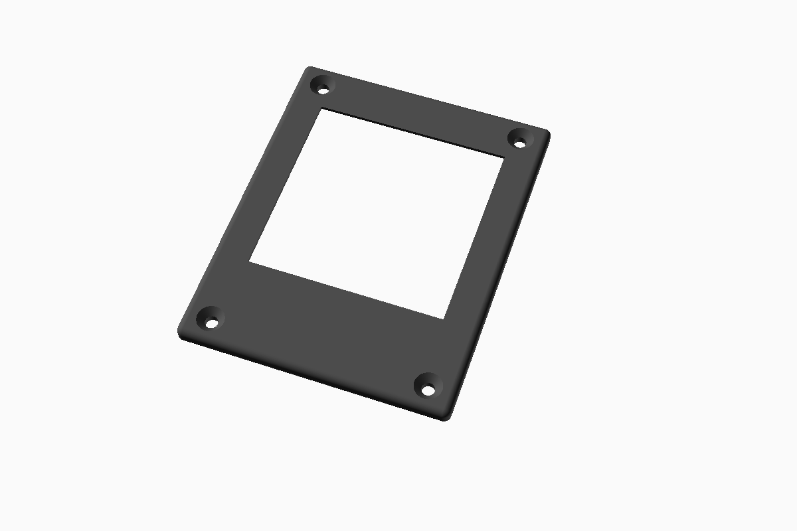</td>
</tr>
 <tr>
    <td><a href="./generated/display-mounting-rack.stl">Display Mounting Rack</a></td>
    <td>
       Display mounting rack for 128x128 pixel OLED Display (1.5")
    </td>
    <td>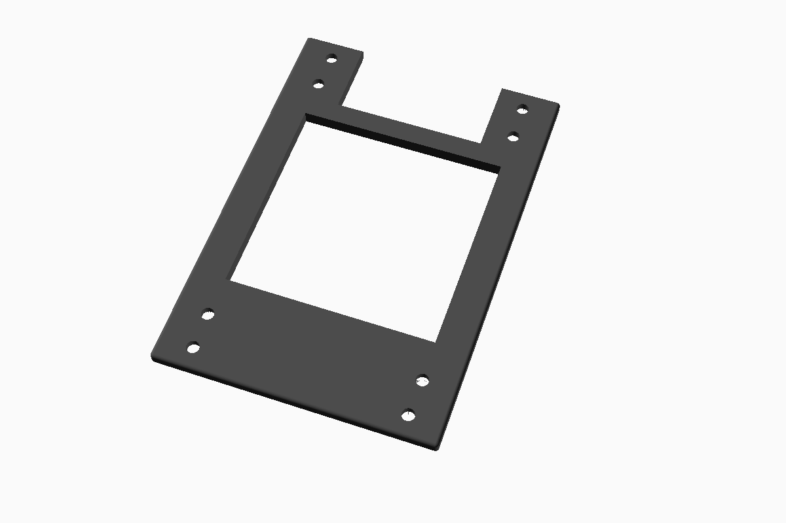</td>
</tr>
<tr>
    <td><a href="./generated/oled-display.stl">OLED Display</a></td>
    <td>
      Model of the 128x128 pixel OLED display (1.5")
    </td>
    <td>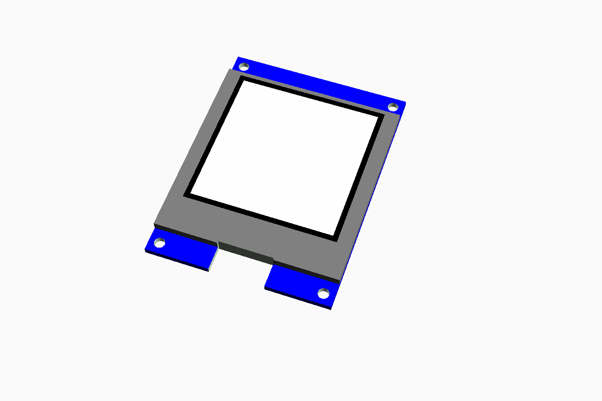</td>
</tr>
 <tr>
    <td><a href="https://github.com/laenzlinger/cnc/tree/main/parts/fixture-plate">CNC Fixture Plate</a></td>
    <td>
       15mm MDF fixture plate for milling the top panel on the SRcnc.
       Maintained in the <a href="https://github.com/laenzlinger/cnc">cnc repo</a>.
    </td>
    <td>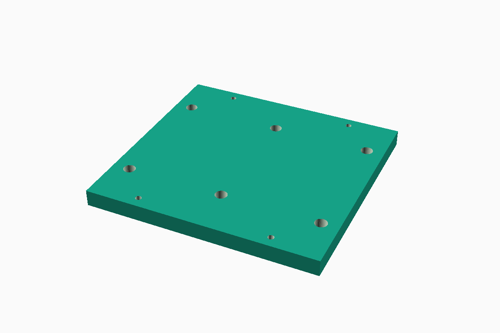</td>
</tr>
<tr>
    <td><a href="./parts/led-ring-flush.scad">LED Ring (flush mount)</a></td>
    <td>
       2mm plexiglass stepped ring for flush-mounted LED illumination.
       ø24mm top lip (1mm) sits in case recess, ø22mm bottom (1mm) drops into button hole,
       ø14mm center hole for actuator. Acts as light diffuser for SK6805-EC15 LEDs.
       CNC cut from plexiglass sheet with 4mm downcut endmill.
    </td>
    <td>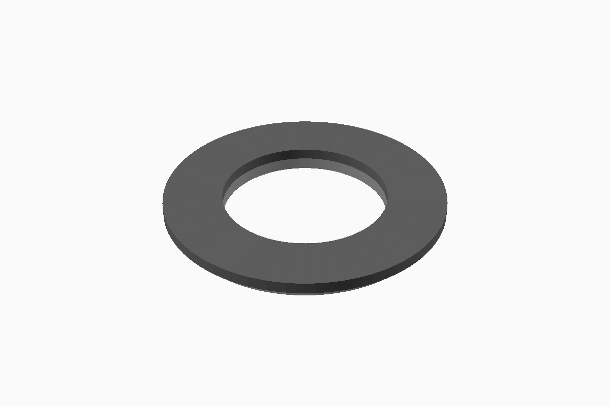</td>
</tr>
<tr>
    <td><a href="./parts/display-window-flush.scad">Display Window (flush mount)</a></td>
    <td>
       2mm plexiglass stepped rectangle for flush-mounted OLED display.
       36.5×38.7mm top lip (1mm) sits in case recess, 34.1×36.3mm bottom (1mm) drops into
       display cutout. Solid window — display visible through plexiglass.
       2mm corner radius (4mm endmill). CNC cut from plexiglass sheet.
    </td>
    <td>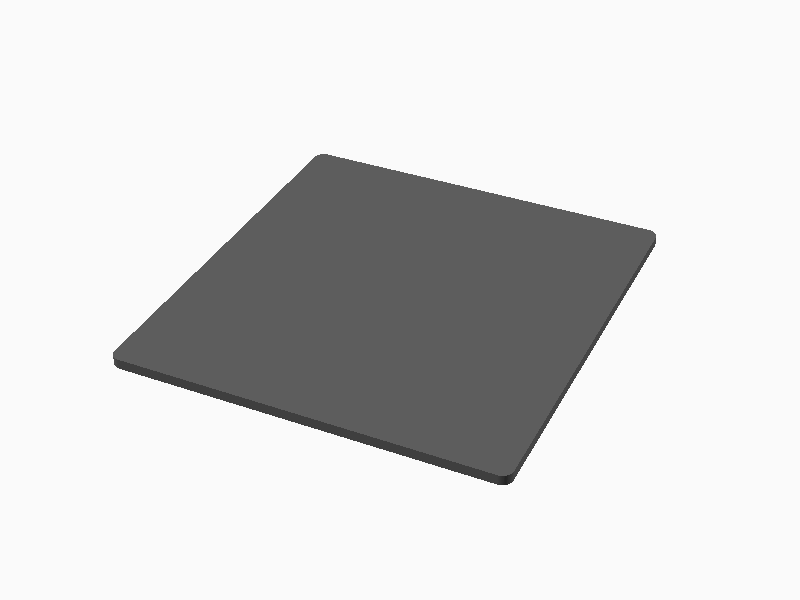</td>
</tr>
<tr>
    <td><a href="./parts/lightpipe-disc.scad">Light Pipe Disc (flush mount)</a></td>
    <td>
       2mm plexiglass disc for flush-mounted light pipe.
       6mm diameter, press-fits into light pipe hole.
       CNC cut from plexiglass sheet with 4mm downcut endmill.
    </td>
    <td>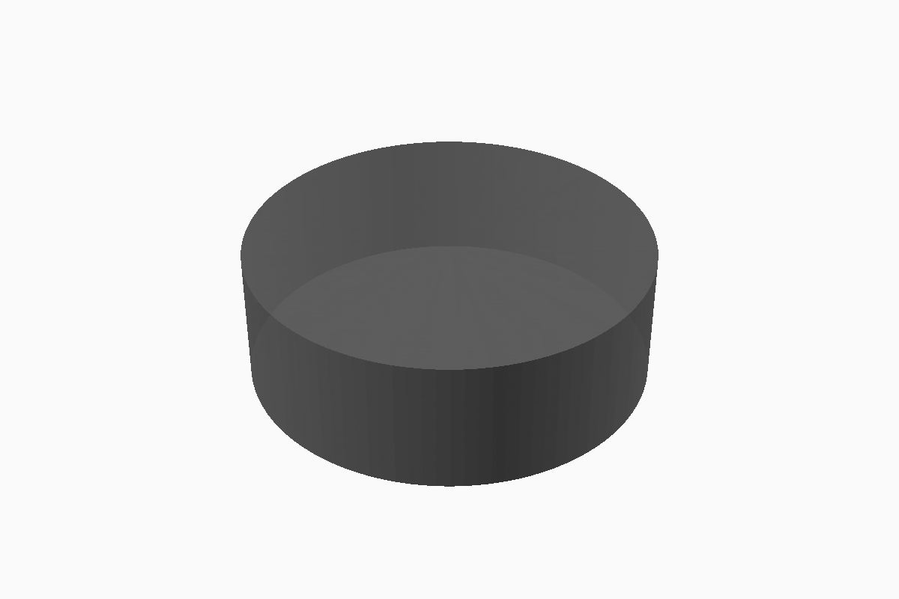</td>
</tr>
</table>

## 3D printable files

See [STL files](./generated)

Some parts are available in two variants:

| Function | 3D printed (PETG) | CNC plexiglass |
|----------|-------------------|----------------|
| Button LED ring | `led-ring-washer.stl` | `led-ring-flush.scad` |
| Encoder LED ring | `led-ring-rotary-washer.stl` | `led-ring-flush.scad` |
| Display window | `display-bezel.stl` + mounting rack | `display-window-flush.scad` |
| Light pipe | `light-pipe.stl` | `lightpipe-disc.scad` |

**3D printed** — uses transparent PETG, easier to make, rougher finish.
Good for prototyping.

**CNC plexiglass** — cut from 2mm translucent acrylic sheet, flush-mount
with stepped profile, cleaner look. Requires CNC and `plexi-cut.py`.

## Top panel generation

All top panel machining outputs are derived from the [pedalboard-display](https://github.com/pedalboard/pedalboard-display) KiCad PCB:

```
pedalboard-display.kicad_pcb
  → extract-coords.py → top-panel-coords.json
  → top-panel-gcode.py → top-panel.nc
  → top-panel-template.py → display-cutout-template.svg/.pdf
```

Regenerate after PCB changes:

```bash
cd parts && make panel
```

## CNC milling workflow

The top panel is milled on the SRcnc machine (Hammond 1590DD die cast aluminium,
open-side-down fixture). Two separate operations: hole cutting, then engraving.

See [cnc/README.md](./cnc/README.md) for full setup instructions, probing geometry,
and testing.

### 1. Cut holes

```bash
cd cnc
python3 probe-setup.py    # close gSender first — script owns the serial port
# → generates top-panel.nc
# Open gSender, load top-panel.nc, dial 1, WD-40, run at 150% feed
```

Tool: 4mm single flute downcut, 300mm/min, 0.3mm depth/pass.

### 2. Engrave labels

```bash
python3 engrave-setup.py  # close gSender first
# → probes 6×10 surface height map, generates engraving.nc
# Open gSender, load engraving.nc, run
```

Tool: 60° V-bit, 150mm/min. The height map compensates for powder coat
variation and panel crown so the V-bit follows the actual surface.
`engrave-setup.py` runs independently — no need to run `probe-setup.py` first.

**Manual G-code generation (without height map):**

```bash
python3 parts/top-panel-gcode.py --angle -0.23 --z-offsets z-offsets.json > top-panel.nc
```

**Origin modes:**
- `center` (default) — G54 X0 Y0 at case center, requires probing edges
- `corner` — G54 X0 Y0 at front-left corner of case top surface

## Plexiglass parts

All flush-mount plexiglass parts (LED rings, display windows, light pipe discs)
are cut from 2mm acrylic sheet (translucent black tea / smoke).

**Generate G-code:**

```bash
# Test cut (1 of each part)
python3 parts/plexi-cut.py > generated/plexi-cut.nc

# Production (8 rings, 2 windows, 2 discs)
python3 parts/plexi-cut.py --production > generated/plexi-production.nc
```

**Cutting parameters:**
- Tool: 4mm single flute downcut
- Spindle: Makita dial 3 (~17,000 RPM)
- Feed: 500 mm/min
- Depth/pass: 0.25mm
- Fixture: double-sided tape, leave protective film on
