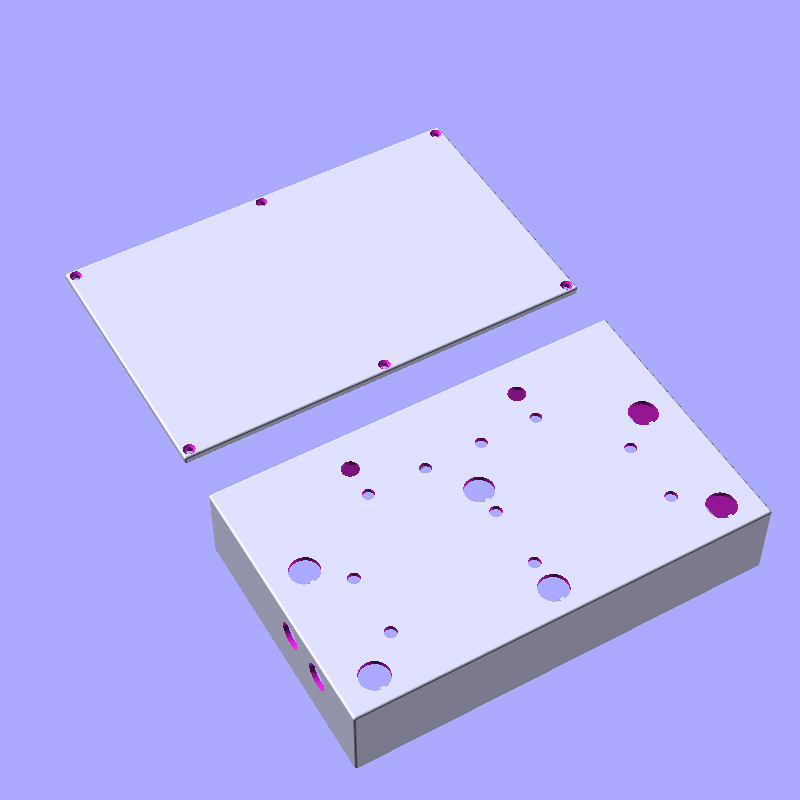

# pedalboard-case

Mechanical 3D models enclosing the hardware.

This project is created with openscad 2021.01

## 3D printable case

3d model for the case which holds pedalboard-hw

interactive [3D model](./generated/pedalboard-case.stl) preview

The model is tuned to have a minimal possible height, i.e. the connectors of the HiFi Berry sound card have be 
be removed. 

However, the model can be paramterizes in its size (e.g. the height), material thickness, etc.

See [source](./parts/pedalboard-case.scad#L5-L12) for some of the interesting paramteters.

## Additional mechanical components

### Foot switch actuator button

https://www.cliffuk.co.uk/products/switches/FC7125.pdf

interactive [3D model](./generated/actuator-assembly.stl) model

* [Actuator](./generated/actuator.stl) with [Nut](./generated/actuator-nut.stl)
* [LED Ring Washer](./generated/led-ring-washer.stl)
