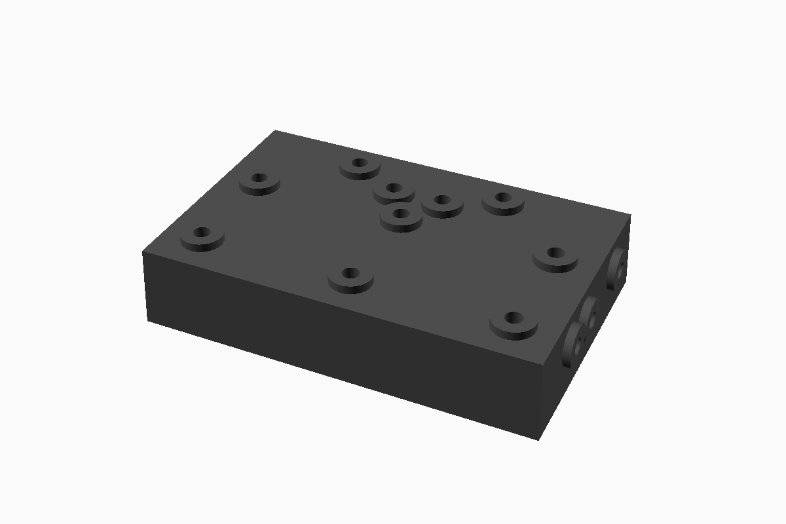
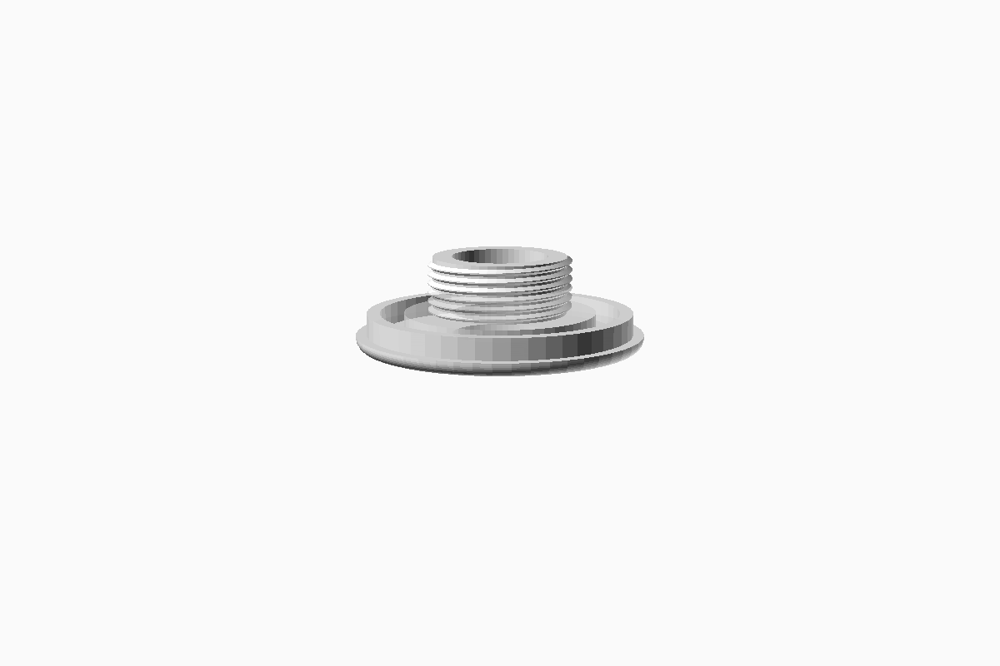
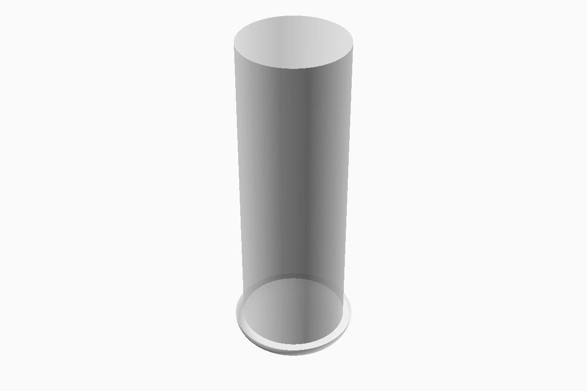
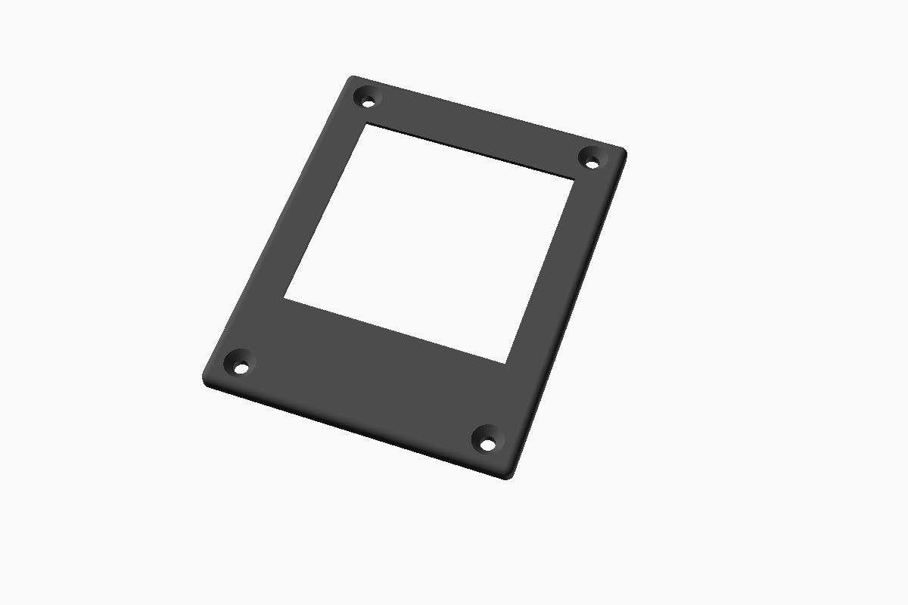
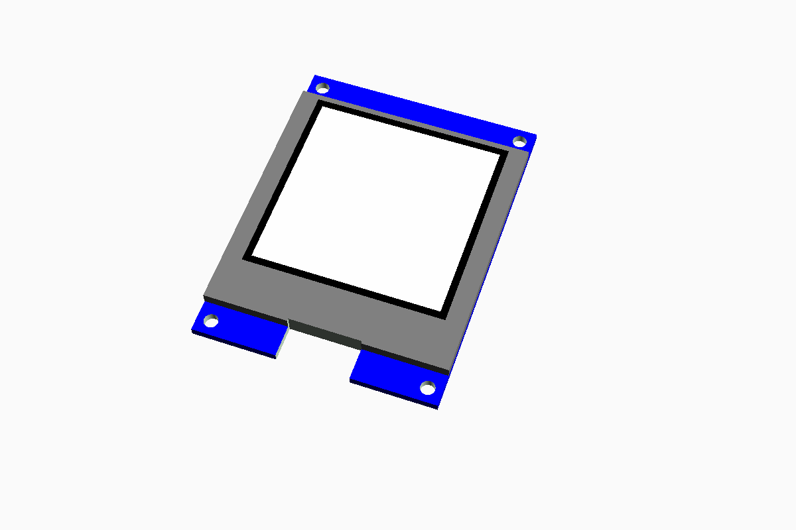

# pedalboard-case

Mechanical 3D models enclosing the hardware.

The parts are created with openscad 2021.01

## Parts

<table>
<tr>
    <th>Part</th>
    <th>Description</th>
    <th>Image</th>
</tr>
<tr>
    <td><a href="./generated/drill-jig.stl">Drill Jig</a></td>
    <td>
        3d model for a drill jig for a - <a href="https://www.hammfg.com/part/1590DD">Hammond Manufacturing 1590DD</a> case.
    </td>
    <td></td>
</tr>
<tr>
    <td><a href="./generated/actuator-assembly.stl">Switch Actuator</a></td>
    <td>
       <a href="https://www.cliffuk.co.uk/products/switches/FC7125.pdf">Manufactured by Cliff</a>.
    </td>
    <td></td>
</tr>
<tr>
    <td><a href="./generated/led-ring-washer.stl">Button Washer</a></td>
    <td>
       LED ring washer for Switch Actuator. Print with transparent PETG.
    </td>
    <td></td>
</tr>
<tr>
    <td><a href="./generated/led-ring-rotary-washer.stl">Rotary Encoder Washer</a></td>
    <td>
       LED ring washer for Rotary Encoder. Print with transparent PETG.
    </td>
    <td></td>
</tr>
<tr>
    <td><a href="./generated/light-pipe.stl">Light Pipe</a></td>
    <td>
       Print with transparent PETG.
    </td>
    <td></td>
</tr>

<tr>
    <td><a href="./generated/display-bezel.stl">Display Bezel</a></td>
    <td>
       Display bezel for 128x128 pixel OLED Display (1.5")
    </td>
    <td></td>
</tr>
 <tr>
    <td><a href="./generated/display-mounting-rack.stl">Display Mounting Rack</a></td>
    <td>
       Display mounting rack for 128x128 pixel OLED Display (1.5")
    </td>
    <td></td>
</tr>
<tr>
    <td><a href="./generated/oled-display.stl">OLED Display</a></td>
    <td>
      Model of the 128x128 pixel OLED display (1.5")
    </td>
    <td></td>
</tr>
</table>

## 3D printable files

See [STL files](./generated)
